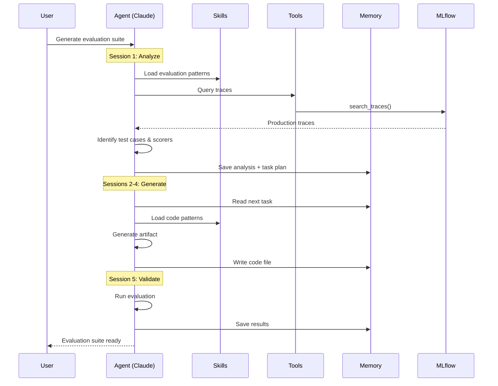

# MLflow Evaluation Agent

An autonomous agent for analyzing MLflow traces and building evaluation suites. Deploys to Databricks via Asset Bundles.

## What It Does

The agent runs an autonomous loop that:
1. **Analyzes traces** in your MLflow experiment to find errors and patterns
2. **Creates a task plan** for building evaluation scorers and datasets
3. **Executes tasks** one per session, with fresh context each time
4. **Generates evaluation code** ready to run against your agent

## Quick Start (Databricks)

### Prerequisites

- [Databricks CLI](https://docs.databricks.com/dev-tools/cli/index.html) configured
- [uv](https://docs.astral.sh/uv/) for Python package management
- A Databricks workspace with:
  - MLflow experiment containing traces to analyze
  - Unity Catalog Volume for session storage
  - Access to Claude models via FM API

### Step 1: Set Up Secrets

Create a secret scope with your Databricks token (used for FM API auth):

```bash
# Create secret scope
databricks secrets create-scope mlflow-eval

# Store your Databricks PAT token
databricks secrets put-secret mlflow-eval databricks-token --string-value "dapi..."
```

### Step 2: Configure Variables

Edit `databricks.yml` or pass as job parameters:

| Parameter | Description | Example |
|-----------|-------------|---------|
| `experiment_id` | MLflow experiment containing traces to analyze | `"123456789"` |
| `volume_path` | Unity Catalog Volume for session storage | `"/Volumes/catalog/schema/mlflow-eval-agent"` |
| `mlflow_agent_experiment_id` | Where the agent logs its own traces | `"987654321"` |

```yaml
# databricks.yml
variables:
  experiment_id:
    default: "YOUR_EXPERIMENT_ID"
  volume_path:
    default: "/Volumes/YOUR_CATALOG/YOUR_SCHEMA/mlflow-eval-agent"
  mlflow_agent_experiment_id:
    default: "YOUR_AGENT_TRACES_EXPERIMENT"
  secret_scope:
    default: "mlflow-eval"
```

### Step 3: Deploy Bundle

```bash
# Install dependencies
uv sync

# Deploy to Databricks (builds wheel automatically)
databricks bundle deploy -t dev
```

### Step 4: Run the Agent

```bash
# Run the notebook job
databricks bundle run eval_agent_notebook -t dev
```

Or run interactively:
1. Open `notebooks/run_eval_agent` in your Databricks workspace
2. Adjust widget parameters in the sidebar
3. Run All cells

## How It Works

```
┌─────────────────────────────────────────────────────────────────┐
│                     AUTONOMOUS LOOP                              │
│         Fresh context per session • File-based state            │
└─────────────────────────────────────────────────────────────────┘
                               │
          ┌────────────────────┴────────────────────┐
          ▼                                         ▼
┌───────────────────────┐                 ┌───────────────────────┐
│   INITIALIZER (1st)   │                 │    WORKER (2nd+)      │
│                       │                 │                       │
│   • Analyze traces    │    creates      │   • Read task list    │
│   • Create strategy   │ ──────────────► │   • Complete 1 task   │
│   • Write task plan   │  eval_tasks.json│   • Update status     │
└───────────────────────┘                 └───────────────────────┘
```

**Session isolation**: Each iteration runs with fresh context. State is persisted via JSON files in the Unity Catalog Volume, allowing the agent to pick up where it left off.

### Agent Flow



## Alternative: Wheel Job

For CI/automation, use the wheel-based job instead:

```bash
databricks bundle run eval_agent_job -t dev
```

This runs the same agent via CLI entry point rather than notebook.

## Local Development

```bash
# Set environment variables
cp .env.example .env
# Edit .env with your configuration (see below)

# Run autonomous mode locally
uv run python -m src.cli -a -e <experiment_id>

# Interactive mode
uv run python -m src.cli -i
```

### Configuring Model Provider

The agent requires access to Claude models. For Databricks users, use the Foundation Model APIs:

```bash
# .env - Databricks FM API configuration
ANTHROPIC_BASE_URL=https://your-workspace.cloud.databricks.com/serving-endpoints
ANTHROPIC_AUTH_TOKEN=dapi...          # Your Databricks PAT token
ANTHROPIC_API_KEY=""                  # Required placeholder (must be empty string)
MODEL=databricks-claude-opus-4-5
```

Alternatively, use the Anthropic API directly:

```bash
# .env - Direct Anthropic API
ANTHROPIC_API_KEY=sk-ant-api03-...
MODEL=claude-sonnet-4-20250514
```

See `.env.example` for full configuration options.

## Project Structure

```
mlflow-eval-agent/
├── src/
│   ├── agent.py          # Agent + autonomous loop
│   ├── cli.py            # CLI entry point
│   ├── config.py         # Configuration
│   ├── tools.py          # MCP tools (query, annotate, save)
│   └── mlflow_ops.py     # MLflow operations
├── notebooks/
│   └── run_eval_agent.py # Databricks notebook
├── prompts/
│   ├── initializer.md    # First session prompt
│   └── worker.md         # Subsequent session prompt
└── databricks.yml        # Asset Bundle config
```