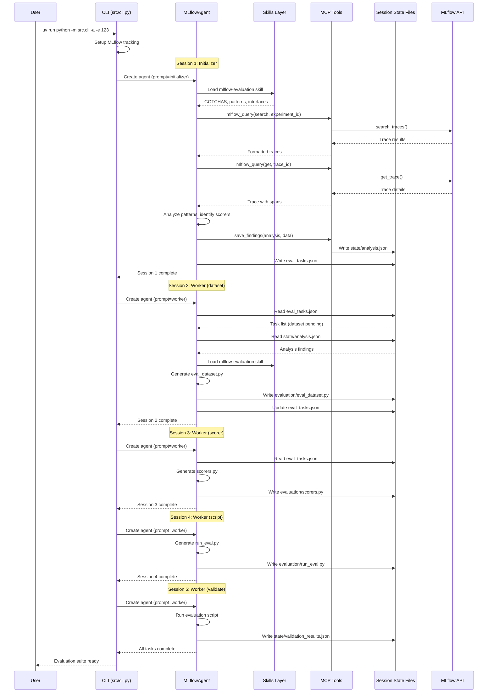

# Agent Communication Flow

This diagram shows how the MLflow Evaluation Agent uses a session-based pattern to generate evaluation suites autonomously.

## Architecture Overview

The agent uses a **single-agent with multiple sessions** pattern rather than multiple sub-agents. Each session runs with fresh context but shares state through files.

## Sequence Diagram



## Key Concepts

### 1. Session-Based Execution

The agent runs as a **single `MLflowAgent` instance** that executes multiple sessions:

| Session | Prompt | Purpose |
|---------|--------|---------|
| 1 | `prompts/initializer.md` | Analyze traces, create task plan |
| 2-N | `prompts/worker.md` | Execute one task per session |

Each session starts with fresh context (no accumulated errors) but reads shared state files for continuity.

### 2. File-Based State

Sessions communicate through JSON files in the session directory:

```
sessions/{timestamp}/
├── eval_tasks.json              # Task list with status (pending/completed)
├── state/
│   ├── analysis.json            # Trace analysis findings
│   └── validation_results.json  # Final validation metrics
└── evaluation/
    ├── eval_dataset.py          # Generated dataset
    ├── scorers.py               # Generated scorers
    └── run_eval.py              # Runnable evaluation script
```

### 3. MCP Tools

Three simplified tools provide MLflow operations:

| Tool | Operations | Purpose |
|------|------------|---------|
| `mlflow_query` | search, get, assessment | Query traces and assessments |
| `mlflow_annotate` | tag, feedback, expectation | Annotate traces |
| `save_findings` | — | Persist analysis to state files |

### 4. Skills Layer

The agent loads the `mlflow-evaluation` skill before generating code:

- `GOTCHAS.md` — 15+ common mistakes to avoid
- `CRITICAL-interfaces.md` — Verified MLflow 3.1+ API signatures
- `patterns-*.md` — Working code patterns for datasets, scorers, evaluation

### 5. Task Types

Worker sessions execute these task types in order:

| Task | Output | Description |
|------|--------|-------------|
| `dataset` | `eval_dataset.py` | Extract test cases from traces |
| `scorer` | `scorers.py` | Create domain-specific scorers |
| `script` | `run_eval.py` | Generate evaluation runner |
| `validate` | `validation_results.json` | Run and verify results |
| `fix` | (repairs files) | Fix issues if validation fails |

## Generating PNG/SVG

To generate an image from the `.mmd` file:

```bash
# Using Mermaid CLI (npm install -g @mermaid-js/mermaid-cli)
mmdc -i docs/agent-communication-flow.mmd -o docs/agent-communication-flow.png

# Or for SVG
mmdc -i docs/agent-communication-flow.mmd -o docs/agent-communication-flow.svg
```
