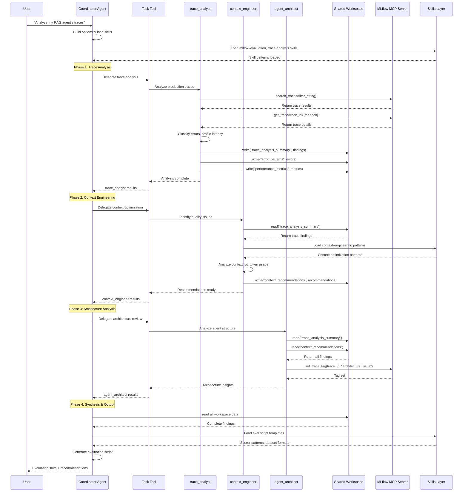

# Agent Communication Flow

This diagram shows how the MLflow Evaluation Agent orchestrates sub-agents through a shared workspace pattern.

## Sequence Diagram



## Key Concepts

### 1. Sequential Sub-agent Execution
Sub-agents execute in a specific order where each builds on previous findings:
1. **trace_analyst** - Analyzes production traces first
2. **context_engineer** - Reads trace findings, generates optimizations
3. **agent_architect** - Reads all findings, provides structural recommendations

### 2. Workspace-based Communication
Sub-agents communicate through a shared workspace rather than direct message passing:
- `trace_analyst` writes: `trace_analysis_summary`, `error_patterns`, `performance_metrics`
- `context_engineer` writes: `context_recommendations`
- All data persists for the session and is accessible to later agents

### 3. MCP Tool Integration
The MLflow MCP Server provides trace operations:
- `search_traces` - Query traces with filters
- `get_trace` - Get detailed trace by ID
- `set_trace_tag` - Tag traces for categorization

### 4. Skills Layer
Skills provide code patterns and domain knowledge:
- `mlflow-evaluation` - Scorer patterns, dataset formats
- `trace-analysis` - Query syntax, error classification
- `context-engineering` - Prompt optimization, token budgets

## Generating PNG/SVG

To generate an image from the `.mmd` file:

```bash
# Using Mermaid CLI (npm install -g @mermaid-js/mermaid-cli)
mmdc -i agent-communication-flow.mmd -o agent-communication-flow.png

# Or for SVG
mmdc -i agent-communication-flow.mmd -o agent-communication-flow.svg
```
