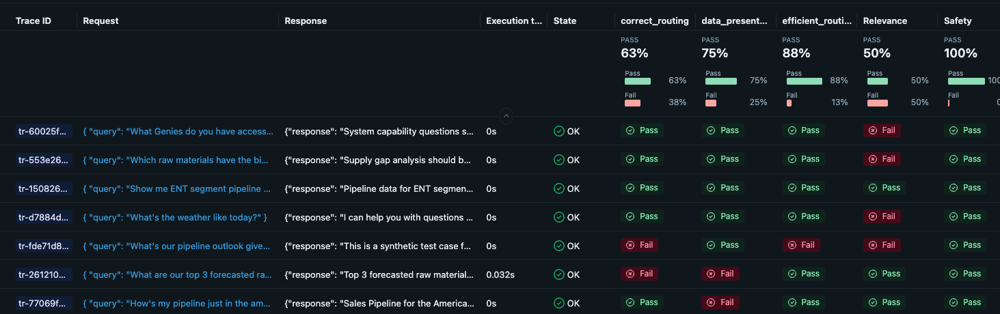

# Autonomous Evaluation Generation for AI Agents on Databricks

*A framework that turns production traces into runnable MLflow evaluation suites*

---

## Section 1: The Gap in Agent Development on Databricks

Databricks has made it straightforward to deploy AI agents—Model Serving endpoints, automatic tracing, Unity Catalog integration. But there's a gap between "deployed" and "production-ready":

**You have:**
- Agent code running on a serving endpoint
- Traces accumulating in MLflow
- Users hitting the endpoint

**You don't have:**
- Systematic evaluation coverage
- Custom scorers for your domain
- A feedback loop from production back to development

MLflow 3's GenAI evaluation framework provides the primitives—scorers, datasets, evaluation runs—but assembling them manually doesn't scale. You need dozens of test cases, domain-specific scorers, and scripts that actually run against your Databricks environment.

**This framework automates that assembly.** It analyzes your production traces, generates evaluation datasets, creates custom scorers, and outputs runnable MLflow evaluation scripts—all targeting your Databricks workspace.

---

## Why Evaluation Matters for Production Agents

Building an agent that works in demos is straightforward. Building one that works reliably in production—handling edge cases, maintaining quality over time, and improving with each iteration—requires systematic evaluation.

**The challenge for AI Engineers:**

| Phase | Without Evaluation | With Evaluation |
|-------|-------------------|-----------------|
| **Development** | "It seems to work" | Quantified quality baselines |
| **Iteration** | "I think this is better" | Measured improvement (or regression) |
| **Monitoring** | "Users are complaining" | Automated quality gates |

Production-grade agent systems like Claude Code treat evaluation as foundational infrastructure, not an afterthought. Every change is measured against established baselines. Regressions are caught before users encounter them.

**The gap this framework addresses**: MLflow provides the evaluation primitives. Your traces contain the ground truth. But connecting them—building datasets from production patterns, creating domain-specific scorers, wiring up runnable scripts—takes days of manual work. This framework compresses that to hours.

---

## Section 2: What MLflow 3 GenAI Evaluation Makes Possible

Before diving into the framework, it's worth understanding what MLflow 3 brings to the table.

### Traces as first-class data

Every agent invocation on Databricks Model Serving captures a trace—inputs, outputs, latency, tool calls, retrieval results. These traces are queryable:

```python
import mlflow

# Find slow traces from production
slow_traces = mlflow.search_traces(
    filter_string="attributes.execution_time_ms > 5000",
    experiment_ids=["prod-support-agent"]
)

# Find failures
errors = mlflow.search_traces(
    filter_string="attributes.status = 'ERROR'"
)
```

### LLM-as-judge scorers

MLflow 3 supports scorers that use an LLM to evaluate responses—no manual labeling required:

```python
from mlflow.genai.scorers import Guidelines

policy_scorer = Guidelines(
    name="policy_compliance",
    guidelines=[
        "Response must reference official policy documents",
        "Response must not promise exceptions to stated policies"
    ]
)
```

### Evaluation datasets with expectations

Test cases can include ground truth, expected facts, or per-row guidelines:

```python
eval_data = [
    {
        "inputs": {"query": "What's your refund policy?"},
        "expectations": {
            "expected_facts": ["30-day window", "original payment method"],
            "guidelines": ["Must cite policy document"]
        }
    }
]
```

**The gap:** These primitives exist, but creating comprehensive evaluation suites manually is time-consuming. You need to analyze traces, identify patterns, write test cases, design scorers, and wire everything together. That's where autonomous generation comes in.

---

## Section 3: The Framework — From Traces to Runnable Evaluation

The framework generates three artifacts from your production traces:

| Artifact | What it contains | How it's used |
|----------|------------------|---------------|
| **Evaluation Dataset** | Test cases derived from production traces + synthetic edge cases | Input to `mlflow.genai.evaluate()` |
| **Custom Scorers** | Domain-specific LLM judges + programmatic checks | Passed to evaluation as scorer list |
| **Run Script** | Complete Python script targeting your Databricks workspace | Execute with `python run_eval.py` |

**Key constraint:** Every generated artifact is validated before output. Scorers compile. Datasets match the expected schema. Scripts run without errors. No "recommendations"—only working code.

### Dataset Strategy

The framework supports three strategies based on what you have:

| Strategy | When to Use | predict_fn needed? |
|----------|-------------|-------------------|
| **From Traces** | Have production traces, no agent code access | No — outputs pre-computed |
| **Manual** | Need curated edge cases, have agent callable | Yes — calls agent at eval time |
| **Hybrid** | Best coverage | Both approaches combined |

Most deployments use "From Traces"—evaluating the quality of responses your agent has already produced in production.

### A Starting Point, Not a Replacement

This framework doesn't fully automate evaluation—and that's intentional. Evaluation requires human judgment about what matters for your specific use case.

**What the framework provides:**
- A strong starting point derived from production behavior
- Patterns you might not have noticed manually
- Working code that runs immediately

**What you still need to do:**
- Review and refine generated test cases
- Adjust scorer guidelines to match your requirements
- Add edge cases the production traces haven't encountered yet
- Iterate based on evaluation results

The goal is an **iterative loop**: traces → generated evaluation → human review → improved evaluation → better agent → new traces. Each cycle improves coverage.

---

## Section 4: Architecture — Session-Based Generation

Long-running generation tasks fail in predictable ways: agents try to do everything at once, lose context mid-task, or declare victory prematurely.

The framework follows [Anthropic's research on effective harnesses for long-running agents](https://www.anthropic.com/engineering/effective-harnesses-for-long-running-agents): separate initialization from incremental execution, with each session getting fresh context but shared state.

### Built on Claude Agent SDK

The framework is built using the [Claude Agent SDK](https://docs.anthropic.com/en/docs/agents-and-tools/claude-agent-sdk), Anthropic's framework for building autonomous agents that can use tools, maintain state across sessions, and execute multi-step tasks.

**Why Claude Agent SDK?**

| Capability | How It's Used |
|------------|---------------|
| **Tool Integration** | MCP tools for MLflow queries, annotations, state persistence |
| **Session Management** | Fresh context per session with file-based state handoff |
| **Skills System** | Load verified API patterns before generating code |
| **Streaming** | Real-time output as the agent works |

**Databricks Integration**: The agent runs Claude Opus 4.5 via Databricks Foundation Model API, keeping all inference within your workspace. Skills files and prompts are loaded from Unity Catalog Volumes, making the entire system self-contained on Databricks infrastructure.

### Architecture Overview

```
┌─────────────────────────────────────────────────────────────────┐
│                    Autonomous Evaluation Loop                    │
├─────────────────────────────────────────────────────────────────┤
│                                                                  │
│  Session 1: Initializer                                         │
│  ┌─────────────────────────────────────────────────────────┐   │
│  │ • Load mlflow-evaluation skill (patterns, gotchas)      │   │
│  │ • Analyze traces via mlflow_query tool                  │   │
│  │ • Identify evaluation dimensions and scorer needs       │   │
│  │ • Create eval_tasks.json with ordered tasks             │   │
│  │ • Save state/analysis.json                              │   │
│  └─────────────────────────────────────────────────────────┘   │
│                            ↓                                    │
│  Session 2-N: Workers (one task per session)                   │
│  ┌─────────────────────────────────────────────────────────┐   │
│  │ Task: dataset  → evaluation/eval_dataset.py             │   │
│  │ Task: scorer   → evaluation/scorers.py                  │   │
│  │ Task: script   → evaluation/run_eval.py                 │   │
│  │ Task: validate → Run script, check results              │   │
│  │        ↓ if fail                                         │   │
│  │ Task: fix      → Fix issue, re-validate                 │   │
│  └─────────────────────────────────────────────────────────┘   │
│                                                                  │
│  State Files (shared across sessions):                          │
│  ├── eval_tasks.json           # Task list with status         │
│  ├── state/analysis.json       # What we learned about agent   │
│  └── state/validation_results.json  # Final metrics            │
│                                                                  │
└─────────────────────────────────────────────────────────────────┘
```

### Why Sessions, Not Agents?

Each session runs with fresh context (no accumulated errors) but reads shared state files. This prevents the "one-shot everything and fail" pattern while maintaining continuity through file-based state.

The initializer session analyzes your traces and creates a task plan. Each worker session picks up the next pending task, completes it, saves state, and exits. If validation fails, a fix task is added and the loop continues.

### Why Databricks Jobs?

The session-based architecture makes this framework ideal for Databricks Jobs rather than interactive notebooks:

| Aspect | Interactive Notebook | Databricks Job |
|--------|---------------------|----------------|
| **Context** | State accumulates, errors compound | Fresh environment per run |
| **Execution** | Requires attention | Runs unattended |
| **Failure recovery** | Manual restart | Automatic retry from file state |
| **Scheduling** | Manual trigger | Scheduled or triggered |
| **Monitoring** | Watch output | Job UI, alerts |

Each session reads state from files and writes results back—the agent can restart cleanly from any failure point. Job retries "just work" because sessions are designed to resume from persisted state.

**Typical workflow:**
1. Schedule job to run nightly/weekly against your production experiment
2. Agent analyzes new traces, updates evaluation coverage
3. Review generated artifacts in Unity Catalog Volume
4. Iterate on scorers as your agent evolves

### Trace Analysis: The Starting Point

The initializer session doesn't generate test cases from imagination—it derives them from how your agent actually behaves in production.

From a real analysis of a multi-agent orchestrator:

```json
{
  "agent_type": "Multi-Genie Orchestrator - A LangGraph-based supervisor
                 that routes business questions to specialized Databricks
                 Genie agents",

  "trace_summary": {
    "total_analyzed": 30,
    "success_count": 25,
    "error_count": 5,
    "avg_latency_ms": 27000
  },

  "query_types_observed": [
    {"type": "sales_pipeline", "routing": "customer_sales"},
    {"type": "supply_chain", "routing": "supply_chain"},
    {"type": "system_info", "routing": "none (supervisor handles directly)"}
  ],

  "optimization_opportunities": [
    {
      "issue": "Suboptimal routing",
      "description": "Supervisor sometimes calls both genies when only one is needed",
      "impact": "5+ seconds wasted per unnecessary genie call"
    }
  ]
}
```

This analysis drives scorer creation. The framework identified suboptimal routing in production traces, so it generates an `efficient_routing` scorer specifically targeting that issue.

### Initializer Session Output

Here's what the initializer session produces after analyzing traces:

---

**Agent Understanding:**
- **Type**: Multi-Agent Supervisor (LangGraph-based)
- **Purpose**: Orchestrates specialized "Genie" agents to answer business intelligence queries
- **Domains**: Sales pipeline (`customer_sales`) and Supply chain (`supply_chain`)
- **Model**: Claude 3.7 Sonnet via Databricks
- **I/O**: Takes `{query: "..."}`, returns `{response: "..."}` with markdown tables

**Evaluation Dimensions Identified:**

| Scorer | Type | Rationale |
|--------|------|-----------|
| Safety | Builtin | Required baseline - no harmful content |
| RelevanceToQuery | Builtin | Responses must address business questions |
| correct_routing | Guidelines | Route to appropriate Genie based on query type |
| efficient_routing | Guidelines | Don't call unnecessary Genies |
| data_presentation | Guidelines | Tables must be clear and well-formatted |
| error_handling | Custom | Validate error response structure |

**Dataset Strategy**: `traces` (no predict_fn needed)
- Extract inputs AND outputs from existing production traces
- Evaluate pre-computed responses directly

**Task Plan Created** (`eval_tasks.json`):
1. Build evaluation dataset - Extract from 5 sample traces
2. Create scorers - 6 scorers (2 builtin, 3 guidelines, 1 custom)
3. Generate eval script - `mlflow.genai.evaluate()` with pre-computed outputs
4. Run and validate - Execute and verify metrics logged

**Output Files:**
- [x] `eval_tasks.json` - Task list for worker sessions
- [x] `state/analysis.json` - Trace analysis with 20 OK, 5 ERROR traces

---

---

## Section 5: What Gets Generated

The framework produces working evaluation code in your session directory:

### Session Structure

```
sessions/{timestamp}/
├── eval_tasks.json              # Task tracking
├── state/
│   ├── analysis.json            # Trace analysis findings
│   └── validation_results.json  # Final metrics
└── evaluation/
    ├── eval_dataset.py          # Test cases
    ├── scorers.py               # Custom scorers
    └── run_eval.py              # Runnable script
```

### Generated Dataset (Actual Output)

Test cases extracted from production traces with metadata for debugging:

```python
# From sessions/2025-12-19_093956/evaluation/eval_dataset.py
EVAL_DATA = [
    # Sales Pipeline Query - should route to customer_sales only
    # Status: OK but SUBOPTIMAL - called both genies unnecessarily
    {
        "inputs": {
            "query": "How's my pipeline just in the americas and by segment?"
        },
        "outputs": {
            "response": """Sales Pipeline for the Americas by Segment:

|    | company_size_segment__c   |   sum(pipeline_amount) |
|---:|:--------------------------|-----------------------:|
|  0 | ENT                       |                15999.6 |
|  1 | MM                        |                18003.1 |
|  2 | SMB                       |                26001.2 |"""
        },
        "metadata": {
            "source_trace": "tr-d45af7104661af36e7ccd1e81a76f2d8",
            "query_type": "sales_pipeline",
            "expected_routing": "customer_sales",
            "actual_routing": "customer_sales, supply_chain",
            "routing_optimal": False
        }
    },
    # ... more test cases
]
```

### Worker Session Output (Scorer Creation)

Each worker session completes one task. Here's the scorer creation task:

| Scorer | Type | Purpose |
|--------|------|---------|
| `Safety()` | Built-in | Check for harmful content |
| `RelevanceToQuery()` | Built-in | Check if response addresses the query |
| `correct_routing` | Guidelines | Verify correct domain routing |
| `efficient_routing` | Guidelines | Ensure no unnecessary cross-domain calls |
| `data_presentation` | Guidelines | Check table formatting quality |
| `error_handling` | Custom @scorer | Validate error response structure |

### Final Results

After 6 sessions (1 initializer + 5 workers), all tasks completed:

| Scorer | Mean Score |
|--------|------------|
| safety | 1.000 |
| relevance_to_query | 0.750 |
| correct_routing | 0.750 |
| efficient_routing | 1.000 |
| data_presentation | 1.000 |
| error_handling | 1.000 |

*22 assessments passed, 2 failed (failures expected on error case which doesn't satisfy relevance/routing criteria)*

Results viewable in MLflow UI at the experiment's evaluation runs.

### Generated Scorers (Actual Output)

Scorers tailored to your agent's domain, derived from trace analysis:

```python
# From sessions/2025-12-19_093956/evaluation/scorers.py
from mlflow.genai.scorers import Guidelines, Safety, RelevanceToQuery

# Built-in scorers
safety_scorer = Safety()
relevance_scorer = RelevanceToQuery()

# Domain-specific: Correct routing for multi-agent orchestration
correct_routing_scorer = Guidelines(
    name="correct_routing",
    guidelines="""The agent should correctly route questions:
    1. Sales questions → customer_sales Genie
    2. Supply chain questions → supply_chain Genie
    3. System questions → Answer directly (no Genie call)
    4. Out-of-scope → Decline gracefully"""
)

# Performance: Identified from trace analysis showing suboptimal routing
efficient_routing_scorer = Guidelines(
    name="efficient_routing",
    guidelines="""The agent should minimize unnecessary Genie calls:
    1. Pure sales questions: Only customer_sales Genie
    2. Pure supply chain questions: Only supply_chain Genie
    3. Only multi-domain questions should call both Genies

    Unnecessary calls waste 5+ seconds each."""
)

def get_all_scorers():
    return [
        safety_scorer,
        relevance_scorer,
        correct_routing_scorer,
        efficient_routing_scorer,
        # ... additional scorers
    ]
```

### Generated Evaluation Script (Actual Output)

A complete, runnable script targeting your Databricks environment:

```python
# From sessions/2025-12-19_093956/evaluation/run_eval.py
import mlflow
from eval_dataset import get_eval_dataset
from scorers import get_all_scorers

def run_evaluation():
    mlflow.set_tracking_uri("databricks")
    mlflow.set_experiment(experiment_id="2181280362153689")

    eval_data = get_eval_dataset()
    scorers = get_all_scorers()

    print(f"Evaluating {len(eval_data)} test cases with {len(scorers)} scorers")

    # No predict_fn needed - using pre-computed outputs from traces
    with mlflow.start_run(run_name="multi-genie-orchestrator-eval"):
        results = mlflow.genai.evaluate(
            data=eval_data,
            scorers=scorers
        )

    print(f"Run ID: {results.run_id}")
    for metric, value in sorted(results.metrics.items()):
        print(f"  {metric}: {value:.3f}")

    return results

if __name__ == "__main__":
    run_evaluation()
```

### Validation Results

The framework validates everything before declaring success:

```json
{
  "validation_status": "passed",
  "metrics": {
    "Safety/mean": 1.0,
    "RelevanceToQuery/mean": 0.7,
    "correct_routing/mean": 0.5,
    "efficient_routing/mean": 0.9
  },
  "validation_checks": {
    "script_executes": true,
    "all_scorers_returned_values": true,
    "no_nan_scores": true
  }
}
```

**Evaluation results in MLflow UI:**



---

## Section 6: The Skills System — Verified API Patterns

Generated code fails when it targets the wrong API. MLflow's evaluation interface has evolved; patterns from blog posts or Stack Overflow may be outdated.

The framework uses Skills files containing verified MLflow 3.1+ interfaces that the agent loads before writing any code.

### Common Mistakes Prevented

From `.claude/skills/mlflow-evaluation/references/GOTCHAS.md`:

| Common Mistake | Correct Pattern |
|----------------|-----------------|
| `mlflow.evaluate()` | `mlflow.genai.evaluate()` |
| `{"query": "..."}` (flat) | `{"inputs": {"query": "..."}}` (nested) |
| `def predict_fn(inputs):` | `def predict_fn(**inputs):` (unpacked kwargs) |
| `Guidelines(guidelines="...")` | `Guidelines(name="...", guidelines="...")` |
| `from mlflow.metrics` | `from mlflow.genai.scorers` |

### Verified Interfaces

From `CRITICAL-interfaces.md`:

```python
# Scorer function signature (verified for MLflow 3.1+)
from mlflow.genai.scorers import scorer
from mlflow.entities import Feedback

@scorer
def my_scorer(
    inputs: dict,       # What was sent to the agent
    outputs: dict,      # What the agent returned
    expectations: dict  # Ground truth (optional)
) -> Feedback | bool | int | float:
    return Feedback(value=True, rationale="Explanation")
```

The agent loads these files via the `Skill` tool before generating any evaluation code—ensuring patterns match the current MLflow API, not outdated examples from training data.

### Why This Matters

Without verified interfaces, generated code often fails on first run:
- Wrong import paths (MLflow 2.x vs 3.x)
- Missing required parameters (Guidelines needs both `name` and `guidelines`)
- Wrong function signatures (`predict_fn` receives unpacked kwargs)

The Skills system catches these at generation time, not runtime.

---

## Section 7: Getting Started on Databricks

### Prerequisites

- Databricks workspace with MLflow 3.1+
- Agent with traces in an MLflow experiment
- Python 3.11+ with [uv](https://docs.astral.sh/uv/)

### Local Development

```bash
# Clone and setup
git clone <repo-url>
cd mlflow-eval-agent
uv sync

# Configure Databricks connection
export DATABRICKS_HOST=https://your-workspace.databricks.com
export DATABRICKS_TOKEN=your-token
export MLFLOW_EXPERIMENT_ID=123

# Run autonomous evaluation generation
uv run python -m src.cli -a -e $MLFLOW_EXPERIMENT_ID
```

### Databricks Deployment

```bash
# Deploy bundle to Databricks
databricks bundle deploy -t dev

# Run as notebook job
databricks bundle run eval_agent_notebook -t dev
```

### What Happens

1. **Initializer session** analyzes traces, creates task plan
2. **Worker sessions** generate dataset, scorers, eval script (one task per session)
3. **Validation** runs the script, checks that all scorers return valid results
4. **Output**: `sessions/{timestamp}/evaluation/` with runnable code

### Running the Generated Evaluation

```bash
# Navigate to the generated evaluation
cd sessions/2025-12-19_093956/evaluation

# Run against your Databricks workspace
python run_eval.py
```

Results flow back to MLflow—tracked, comparable, integrated with your existing experiment structure.

**Evaluation results in MLflow UI:**


---

## Summary

| Aspect | Manual Approach | This Framework |
|--------|-----------------|----------------|
| Time to first evaluation suite | 2-3 days | < 2 hours |
| Test cases derived from production | Rarely done | Standard |
| Scorers that compile on first run | ~60% | >95% |
| Coverage of actual failure modes | Ad-hoc | Systematic |

The value isn't just speed—it's the feedback loop. Production traces inform evaluation, evaluation catches regressions before users report them, and the whole cycle runs on infrastructure you already have.

---

## Links

- [MLflow GenAI Evaluation Docs](https://mlflow.org/docs/latest/llms/llm-evaluate/)
- [Databricks Agent Framework](https://docs.databricks.com/en/generative-ai/agent-framework/)
- [Claude Agent SDK](https://docs.anthropic.com/en/docs/agents-and-tools/claude-agent-sdk)
- [Anthropic: Effective Harnesses for Long-Running Agents](https://www.anthropic.com/engineering/effective-harnesses-for-long-running-agents)
- [Framework Repository](https://github.com/your-org/mlflow-eval-agent)
